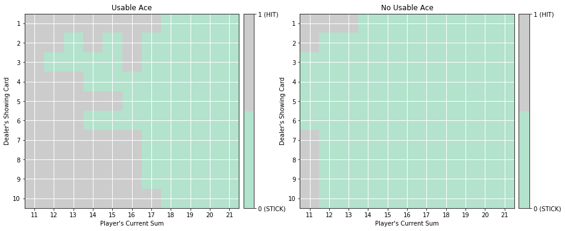
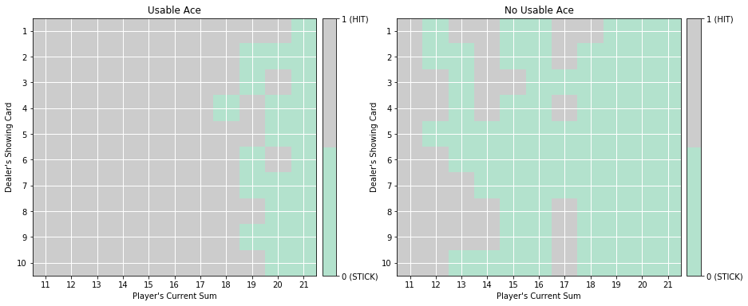
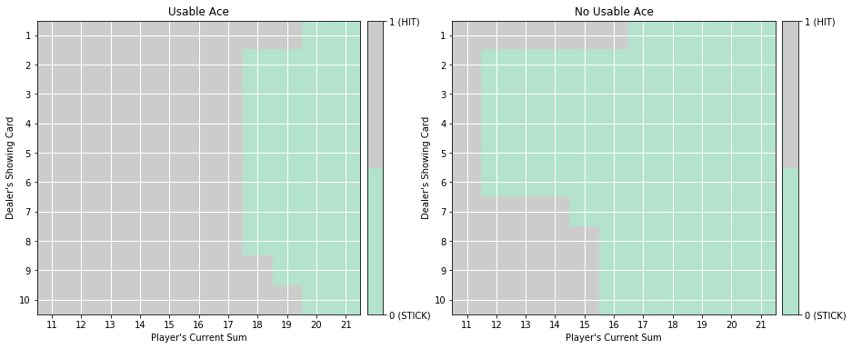
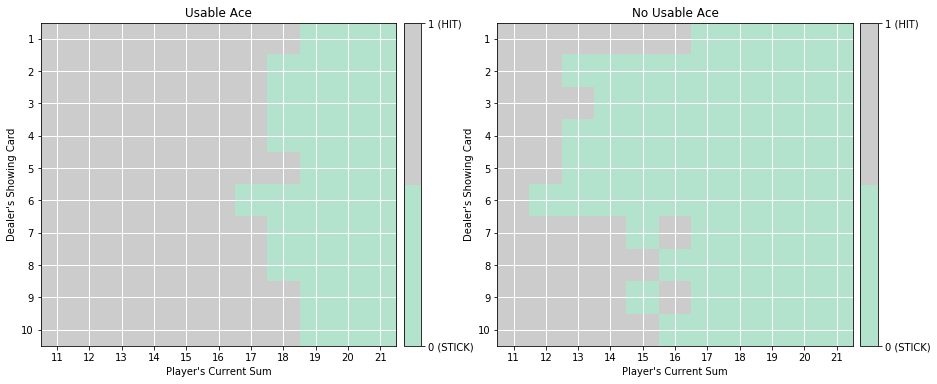

# Monte-Carlo-Prediction

## Environment
    - State Space = (Discrete(32), Discrete(11), Discrete(2))
    - Action Space = {0, 1}
```
Simple blackjack environment
Blackjack is a card game where the goal is to obtain cards that sum to as
near as possible to 21 without going over.  They're playing against a fixed
dealer.
Face cards (Jack, Queen, King) have point value 10.
Aces can either count as 11 or 1, and it's called 'usable' at 11.
This game is placed with an infinite deck (or with replacement).
The game starts with each (player and dealer) having one face up and one
face down card.
The player can request additional cards (hit=1) until they decide to stop
(stick=0) or exceed 21 (bust).
After the player sticks, the dealer reveals their facedown card, and draws
until their sum is 17 or greater.  If the dealer goes bust the player wins.
If neither player nor dealer busts, the outcome (win, lose, draw) is
decided by whose sum is closer to 21.  The reward for winning is +1,
drawing is 0, and losing is -1.
The observation of a 3-tuple of: the players current sum,
the dealer's one showing card (1-10 where 1 is ace),
and whether or not the player holds a usable ace (0 or 1).
This environment corresponds to the version of the blackjack problem
described in Example 5.1 in Reinforcement Learning: An Introduction
by Sutton and Barto.
http://incompleteideas.net/book/the-book-2nd.html
```

## Monte Carlo methods
- ### Control after all episodes(random action)
    

- ### MC Greedy Policy Control after each episode
    

- ### MC epsilon-Greedy Policy Control after each episode
    

- ### MC epsilon-Greedy Policy Control after each episode with constant alpha incremental mean
    